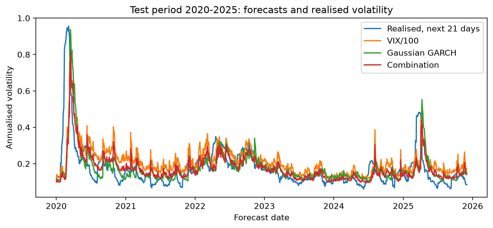
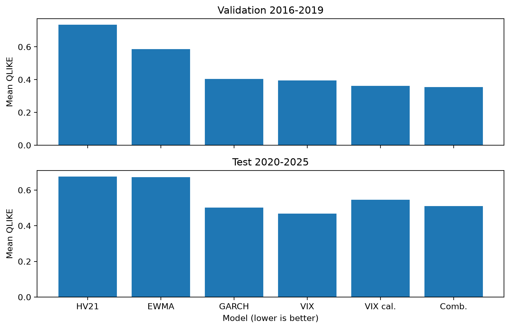

# market-vs-model-volatility

Does the VIX tell you anything about next month's S&P 500 volatility that a
GARCH model fitted on past returns doesn't already know?

I built a forecasting study in Python to test this. The VIX is the market's
own forecast of volatility, backed out of S&P 500 option prices. I compared
it with a walk-forward GARCH(1,1) and four other forecasts, on 22 years of
daily CRSP data. Every forecast only uses information available on the day
it's made. The models were chosen using 2016-2019, and 2020-2025 was kept
aside as a test period and run once at the end.

Result on the 2020-2025 test period: on average loss the two are basically
tied, but VIX does carry information that GARCH misses.

- QLIKE: VIX 0.468, GARCH 0.502. The difference isn't significant
  (HAC t = 0.47, p = 0.64).
- Regressing realised variance on both forecasts at once, VIX keeps its
  coefficient (b = 0.90, p = 0.028) and GARCH's goes to about zero
  (b = -0.05, p = 0.81).

Built with Python (pandas, statsmodels, arch, matplotlib, pytest).



The blue line is plotted on the forecast date but measured over the next 21
trading days, which is why it moves before everything else.

## Setup

Daily S&P 500 Composite price returns from CRSP (via WRDS) and daily VIX
closes from Cboe, 2003-2025. VIX is left-joined onto the CRSP calendar, so a
missing VIX day can never knock a return out of someone's 21-day window.

| period     | dates     | used for                            | days scored |
|------------|-----------|-------------------------------------|------------:|
| warm-up    | 2003      | first GARCH fit, filling HV21       | -           |
| train      | 2004-2015 | fitting `vix_cal` and `combination` | 3,000       |
| validation | 2016-2019 | checking everything                 | 985         |
| test       | 2020-2025 | final run                           | 1,487       |

Forecasts are made at the close of day t. The target is annualised realised
variance over the next 21 trading days:

```
RV_t = (252 / 21) * sum_{j=1..21} r_{t+j}^2      (r = daily log return)
```

A day only counts for a period if its whole 21-day window ends inside that
period, so nothing in late 2019 leaks into 2020.

Models:

- `hv21`: average squared return over the last 21 days, times 252
- `ewma`: RiskMetrics, lambda = 0.94 (Hull 23.2)
- `garch`: zero-mean Gaussian GARCH(1,1) using `arch`. Refit at the start of
  every quarter on an expanding window, only using returns before the refit
  date. Parameters stay fixed inside the quarter and the variance updates
  daily. This keeps going through validation and test, so the parameters
  aren't frozen at 2015. A forecast in 2023 can use returns from 2020-2022,
  which is fine because they'd have been known at the time; no realised-vol
  targets are ever used. The 21-day forecast is the average of the k-step
  forecasts (Hull 23.6). alpha + beta stayed between 0.976 and 0.993 over the
  88 refits.
- `vix`: (VIX / 100)^2. VIX comes from option prices, so it's a risk-neutral
  number rather than a straight forecast of realised variance. People pay
  extra for protection, so I expected it to sit above realised vol on average.
- `vix_cal`: OLS of realised vol on VIX/100, fit once on train and frozen.
  Came out as `-0.022 + 0.936 * VIX/100`.
- `combination`: OLS of realised vol on VIX/100 and GARCH vol, same idea.
  `-0.015 + 0.654 * VIX/100 + 0.307 * garch_vol`.

The main loss is QLIKE on variance, `RV/h - log(RV/h) - 1`. For VIX vs GARCH
I regress the daily QLIKE difference on a constant with Newey-West standard
errors and 21 lags. It's basically a Diebold-Mariano test.

## Results

| model         | val QLIKE | test QLIKE | test RMSE (vol) | test bias (vol) |
|---------------|----------:|-----------:|----------------:|----------------:|
| `hv21`        | 0.735     | 0.676      | 0.122           | -0.001          |
| `ewma`        | 0.587     | 0.673      | 0.118           | +0.005          |
| `garch`       | 0.404     | 0.502      | 0.104           | +0.001          |
| `vix`         | 0.396     | **0.468**  | 0.106           | +0.036          |
| `vix_cal`     | 0.362     | 0.545      | 0.099           | +0.001          |
| `combination` | **0.355** | 0.510      | **0.099**       | +0.002          |

Lower QLIKE is better. Bias is forecast minus realised, in annualised vol.
Unrounded numbers are in `results/summary.csv`.



(The two panels have different y-axes.)

A few things I noticed:

- The two models fitted on train were 1st and 2nd on validation, then 3rd and
  4th on test. If I'd picked one model on validation I'd have picked
  `combination`.
- VIX beat GARCH in both periods but never by much. Mean loss difference was
  0.009 on validation (p = 0.78) and 0.034 on test (p = 0.64, 95% CI roughly
  -0.11 to +0.18).
- `combination` has the lowest test RMSE (0.0986, just ahead of `vix_cal` at
  0.0991) while `vix` wins on QLIKE, so "best model" depends on the loss.
- Test errors are about double the validation ones, mostly because of
  March-April 2020 and April 2025.

### Encompassing regression

`RV_t = a + b_vix * h_vix + b_garch * h_garch`, HAC(21) errors:

|            | b_vix (se)    | p      | b_garch (se)   | p    | R^2  |
|------------|---------------|--------|----------------|------|------|
| validation | 0.617 (0.138) | <0.001 | -0.009 (0.178) | 0.96 | 0.26 |
| test       | 0.896 (0.409) | 0.028  | -0.054 (0.227) | 0.81 | 0.19 |

Same pattern in both periods: once VIX is in, GARCH adds nothing. I wouldn't
push the test result too hard though. The interval for b_vix is wide (about
0.09 to 1.70), it's in variance levels, and a few weeks in March 2020 are
probably doing a lot of the work. In validation b_vix is clearly below 1,
which fits with VIX running high.

### Calibrating VIX made it worse

Raw VIX is too high on average, by about 3.5 vol points in both validation
(+0.034) and test (+0.036). I'm reading that as the variance risk premium.
`vix_cal` gets rid of it: test bias goes from +0.036 to +0.001 and RMSE from
0.106 to 0.099. But QLIKE goes from 0.468 to 0.545.

This confused me for a while. I think it's because I fit the calibration in
vol units and then squared it. If you get E[vol] right, then E[vol]^2 is
below E[vol^2] (Jensen), so the variance forecast ends up too low on average.
QLIKE punishes forecasts that are too low much more than ones that are too
high: forecasting half the realised variance costs about 0.31, double costs
about 0.19. So the premium in raw VIX was actually helping it under QLIKE.
Fitting in variance units or minimising QLIKE directly should fix this, but I
haven't run that on the test set.

### Biggest disagreements

The three test days with the largest gap between VIX and GARCH vol, forced to
be at least 63 trading days apart (the rule is in `src/validation.py`):

| date       | S&P that day | VIX   | GARCH | realised next 21d | closer |
|------------|-------------:|------:|------:|------------------:|--------|
| 2020-03-24 | +9.4%        | 61.7% | 82.4% | 47.9%             | VIX    |
| 2021-01-27 | -2.6%        | 37.2% | 17.7% | 15.4%             | GARCH  |
| 2025-04-09 | +9.5%        | 33.6% | 55.2% | 23.2%             | VIX    |

2020-03-24 and 2025-04-09 are both huge up days. GARCH only sees r^2, so a
+9% rally hits it the same as a -9% crash, and with alpha + beta near 0.99 it
stays high for weeks. VIX actually fell on 2025-04-09 after the tariff pause.
It was much closer both times.

2021-01-27 is the one that goes against VIX. GameStop week: VIX jumped to 37,
GARCH said 18, and realised came in at 15. My guess is VIX was pricing fear
of hedge funds being forced to de-risk, which never showed up in index vol.

QLIKE values for each case are in `results/disagreement_cases.csv`.

## Why I set it up this way

Some choices that aren't obvious:

- QLIKE rather than MSE. Realised variance from daily returns is a very
  noisy proxy. Patton (2011) shows QLIKE and MSE still rank forecasts the same
  way they would against the true variance, and QLIKE is scale-free, so the
  ranking isn't decided by the five most volatile weeks the way MSE on
  variance would be. RMSE is still in the table.
- Gaussian GARCH even though returns are fat-tailed. I only use the variance
  forecast, not the tails, and the normal likelihood still gives consistent
  variance parameters when the errors aren't normal (quasi-ML). A t-GARCH
  would have turned this into a comparison of GARCH variants.
- Quarterly refits. On an expanding window the parameters barely move from one
  quarter to the next, and refitting daily would be slow for little change. I
  didn't try other refit frequencies.
- 21-day horizon. It's the closest trading-day match to the roughly 30
  calendar days the VIX is quoting.
- 21 HAC lags. Neighbouring targets share 20 of their 21 days, so the loss
  differences are autocorrelated out to at least lag 20.
- A validation period even though nothing was tuned on it. Its job was to
  check the whole pipeline and see how the two train-fitted models behaved out
  of sample before touching 2020-2025.
- No machine learning. Train and validation together only hold about 190
  non-overlapping 21-day windows, which isn't much to fit anything flexible
  on, and the question was whether VIX has information, not how well I can fit.
- Calibration in vol units. In hindsight this was the wrong call (see above).

## Notes and limitations

- One test period, and it's dominated by COVID and April 2025. I didn't rerun
  without March 2020 because I'd decided not to add anything after seeing
  the test, but it's the first thing I'd want to know.
- The test period was run once, after the models were chosen on 2016-2019.
  `OPEN_HOLDOUT` in `src/data.py` kept forecasts stopped at 2019 until I
  switched it on, and back then `run_pipeline.py` refused to score the test a
  second time. Now the results are published I've taken that refusal out so
  anyone can rerun the whole thing; it still checks the train and validation
  numbers match the saved ones. I only put the project on git at the end, so
  the commit history can't show that order. Running this commit unchanged on
  2026 data would be the clean check.
- VIX covers about 30 calendar days, while the target is 21 trading days.
- Daily squared returns are a noisy target. Intraday realised variance
  would be better.
- 21 Bartlett lags might be slightly low for 20 days of overlap, so the
  standard errors could be a bit small. That would only make the QLIKE
  result weaker, but it could flatter the encompassing p-value.
- Only a symmetric Gaussian GARCH on one index.

Next things I'd try, none of them run on the test set:

1. Calibrate VIX in variance units, or by minimising QLIKE.
2. GJR-GARCH, since both big GARCH misses were rallies.
3. Intraday realised variance as the target.
4. This exact commit on 2026 data.

## Tests

`pytest` runs 27 tests. The ones that actually matter:

- target timing: plant a single 10% return in a series of zeros and check it
  only shows up in the 21 targets before it, never in its own day's target
- splits: no target window crosses a period boundary
- lookahead: overwrite every return and VIX value after a cutoff with
  garbage, and check that no forecast up to the cutoff changes (including the
  walk-forward GARCH)
- my GARCH one-step and 21-day recursion matches `arch`'s own forecast
- the whole pipeline runs end to end on simulated data

## Running it

```
pip install -r requirements.txt
python -m pytest
python -m scripts.run_demo        # simulated data, no CRSP needed
python -m scripts.run_pipeline    # real data, reproduces results/
```

CRSP is licensed so the data isn't in the repo. The demo simulates GARCH
returns plus a fake VIX and writes to `results/synthetic_demo/` (not real
results). For the real run, put these in `data/raw/`:

- `crsp_sp500_daily.csv`: S&P 500 Composite (INDNO 1000502) from WRDS,
  with `DlyCalDt` and `DlyPrcRet`, dates as YYYY-MM-DD
- `vix_history.csv`: the VIX history file from
  [Cboe](https://www.cboe.com/tradable_products/vix/vix_historical_data/)

All the fixed settings (dates, horizon, lambda, refit frequency, HAC lags)
are at the top of `src/data.py`.

```
src/
  data.py         settings, loading and cleaning
  features.py     target, hv21, ewma, vix
  models.py       walk-forward garch, vix_cal, combination
  metrics.py      qlike, HAC tests, encompassing regression
  validation.py   splits, scoring, disagreement cases
scripts/
  run_pipeline.py
  run_demo.py
tests/
results/
  summary.csv
  disagreement_cases.csv
  figures/
```

## References

- Hull, *Options, Futures, and Other Derivatives*, 11th ed. Ch. 23 for EWMA
  and GARCH, 15.11 and 26.16 for VIX.
- McKinney, *Python for Data Analysis*, 3rd ed. Ch. 8 and 11.
- Christensen and Prabhala (1998), The relation between implied and
  realized volatility, JFE 50(2).
- Newey and West (1987), Econometrica 55(3).
- Patton (2011), Volatility forecast comparison using imperfect volatility
  proxies, J. Econometrics 160(1).

MIT license for the code. CRSP data is subject to WRDS terms.
